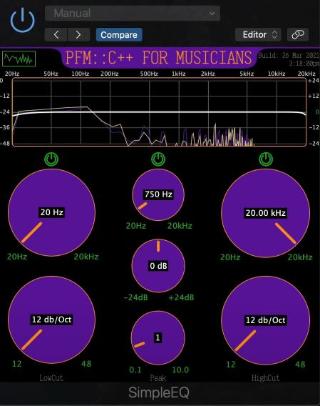
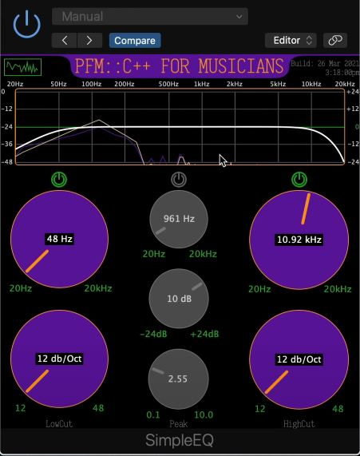

# Audio Equalizer Plugin

# Overview
This project uses C++ with the JUCE framework to create an audio equalizer plugin with custom notches for each band equalizer and spectrum analyzer. JUCE is used to help create the desktop application for this audio plugin and furthermore to host the audio plugin.

# Features
**3 Band Equalizer**
* Low cut and high cut bands with sliders to control frequency and steepness of cut
* Parametric band controls notches or boosts controlling how wide or narrow they may be with frequency control
* Bypass buttons to disable specific bands (high, low, parametric)

**Spectrum Analyzer**
* Spectrum analyzer to visualize what is being heard (comes with bypass button to save CPU usage)
* Filter response curve to identify changes made versus original audio

